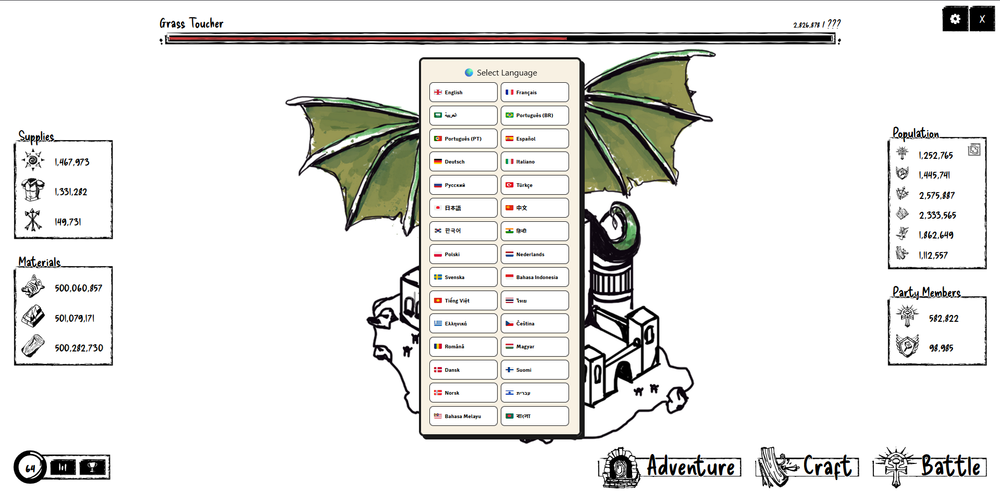
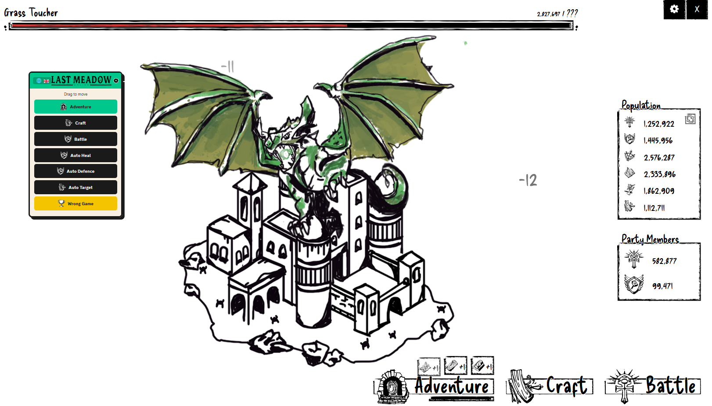

# 🌿 The Last Meadow - Ultimate Auto GUI (auto farm)

<p align="center">
  <a href="LICENSE"></a>
  <a href="https://github.com/xKhalidAlharbi/The-Last-Meadow-Ultimate-Auto-GUI-auto-farm-discord/commits/main"></a>
  <a href="Script.js"></a>
  <a href="https://discord.com/"></a>
  <a href="https://www.jsdelivr.com/package/gh/xKhalidAlharbi/The-Last-Meadow-Ultimate-Auto-GUI-auto-farm-discord"></a>
</p>

This is the **main automation script** for the Discord mini-game "The Last Meadow".  
It keeps the fast GUI workflow from the original release, but the source now lives in a separate file so the repository is easier to maintain.

### ✨ What makes this useful?
- **Supports 30+ Languages:** Use the GUI in your preferred language.
- **Auto Heal:** Handles the heal flow automatically.
- **Auto Battle:** Enters and loops Battle mode when ready.
- **Auto Defence:** Helps with the defence game flow.
- **Auto Target:** Locks and clicks the target automatically.
- **Lightning Fast Crafting:** Solves crafting sequences through the GUI script.
- **Adventure Auto Loop:** Adjustable speed down to very low delay values.
- **Stop All Control:** Quickly shuts down every running automation loop.
- **Saved Preferences:** Remembers language, speed sliders, minimized state, and GUI position.
- **Separated Source File:** The main script is now stored in [Script.js](./Script.js).

---

### 🚀 How to Setup

This script is for the **Discord desktop app**. If you are using an older version, refresh Discord first.

1. Open Discord and press `Ctrl + R`.
2. Press `Ctrl + Shift + I` to open **Developer Tools**.
3. Open the **Console** tab.
4. Use either the auto-loader or manual method below.
5. Select your language and start the features you want.

#### Enable Developer Tools

If `Ctrl + Shift + I` does not open Developer Tools:

1. Fully close Discord from the system tray.
2. Press `Win + R`, paste `%APPDATA%\discord`, and open `settings.json`.
3. Add this setting inside the JSON object:

```json
"DANGEROUS_ENABLE_DEVTOOLS_ONLY_ENABLE_IF_YOU_KNOW_WHAT_YOURE_DOING": true
```

4. Save the file, reopen Discord, then press `Ctrl + Shift + I`.

Discord **Developer Mode** in settings is not the same as desktop Developer Tools.

#### Auto Loader

Paste this into the console to always load the latest `Script.js` from this repository:

```javascript
await fetch("https://cdn.jsdelivr.net/gh/xKhalidAlharbi/The-Last-Meadow-Ultimate-Auto-GUI-auto-farm-discord@main/Script.js")
  .then((response) => response.text())
  .then((code) => (0, eval)(code));
```

#### Manual Method

Open [Script.js](./Script.js), copy the full file, paste it into the Discord console, and press `Enter`.

---

### 📁 Project Files

- [Script.js](./Script.js) - main source file
- [GUIDE.md](./GUIDE.md) - setup, controls, updating, and troubleshooting
- [CHANGELOG.md](./CHANGELOG.md) - full repository history based on git commits

---

### 🖼️ Screenshots





---

### 📚 Guide

For a fuller walkthrough, open [GUIDE.md](./GUIDE.md).

---

### 📝 Changelog

Full history is also available in [CHANGELOG.md](./CHANGELOG.md).

<details>
<summary>Show full changelog</summary>

#### Unreleased
- Added GUI version label, saved preferences, Stop All, and Reset Position controls on the testing branch.

#### 2026-04-07
- `4e7a178` Fixed the auto-loader URL to use the fork's jsDelivr path.
- `6579f47` Moved the embedded script into `Script.js` and refreshed the docs.
- `a02575f` Fixed the settings slider behavior.
- `a02575f` Fixed Auto Target reliability.

#### 2026-04-04
- `e33d00a` Added more repository images.
- `ba98192` Added repository images.
- `d41a23d` Updated the README.
- `3e6c655` Added uploaded project files.
- `b8a91b5` Updated the README title to mention auto farm.
- `4da50dc` Added full automation support.
- `f75b870` Updated the placeholder print statement from `Hello` to `Goodbye`.
- `391af47` Initial commit.

</details>
